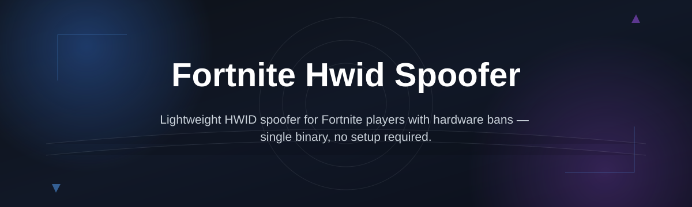

# fortnite-hwid-val-toolkit

*A hardware ID reset toolkit for Fortnite players who got hit with a machine-level lock and need a clean, documented way forward.*

## What this is

**fortnite-hwid-val-toolkit resets the hardware identifiers that Windows and Fortnite's anti-cheat layer use to recognize your machine.**

The story behind this repo

This project started because a small group of players kept running into the same wall: a hardware-level restriction that outlived the account it was tied to, with no clear path to understanding what was actually being checked. Support tickets went unanswered, forum threads got locked, and most "solutions" floating around were unverified executables from anonymous uploaders. A few contributors decided to document the actual Windows identifiers involved — disk serials, SMBIOS UUIDs, network adapter IDs — and build an open, inspectable toolkit around resetting them safely. What began as a personal fix became a small community project, maintained in the open so anyone can read the code, suggest changes, or flag when Fortnite's checks shift after an update.

A Fortnite HWID spoofer, in practical terms, is software that regenerates the machine-level values Windows exposes to applications — things a game client or anti-cheat service can read to fingerprint a PC independently of your Windows account or Epic account. fortnite-hwid-val-toolkit focuses specifically on that layer: it does not touch your Fortnite files, your Epic account, or matchmaking behavior.

The toolkit is built and maintained by contributors who play the game and got tired of guessing which registry keys and identifiers actually matter. Every release aims to be transparent about what it changes on your system, why, and how to reverse it if something looks off. Issues and pull requests are welcome — this is meant to stay a community reference, not a black box.

  

<em>The button opens the project's landing page, where the current build is available to download.</em>

## Who it's for

- **Players locked out after a hardware flag** — you can log into Epic fine, but the game itself refuses to load on this machine.
- **Second-PC or rebuild users** — you reinstalled Windows or swapped a drive and now the identifiers don't match what they used to.
- **Contributors interested in anti-cheat internals** — people who want to read real code instead of another mystery `.exe`.
- **Shared or refurbished PC owners** — the machine has history from a previous owner and you want a documented reset.
- **QA testers and modders** — anyone who needs a repeatable way to reset machine fingerprints between test runs.

## What you can do

- **Reset core Windows identifiers** — regenerates disk volume serials, SMBIOS/UUID values, and MAC-adapter fingerprints in one pass.
- **Preview changes before applying them** — a dry-run mode shows exactly which values will change.
- **Roll back a session** — restores the previous identifier set if something doesn't behave as expected.
- **Run without installing anything** — a single standalone executable, no background service left behind.
- **Check current HWID values** — a read-only report mode for confirming what your system currently exposes.
- **Log every action locally** — a plain-text log of what was changed, timestamped, kept on your machine only.
- **Target specific identifier groups** — choose disk, network, or system UUID resets independently instead of all at once.
- **Stay update-aware** — the tool flags when Fortnite's client version has shifted since the last verified run.

## Getting started

1. Open the [landing page](https://Fangbraimagine.github.io/fortnite-hwid-val-toolkit/) and download the current build.
2. Close Fortnite, Epic Games Launcher, and any anti-cheat services running in the background.
3. Run the executable as Administrator — this is required to write hardware identifiers at the system level.
4. Review the preview screen, confirm the identifiers you want reset, and apply.
5. Restart Windows, then launch Fortnite normally to confirm the change took effect.

## Requirements

- Windows 10 or Windows 11 (64-bit)
- Administrator privileges on the account running the tool
- No development toolchain, runtime, or dependency installation needed
- Standalone executable — nothing is installed system-wide, nothing runs as a background service afterward

## How it works

The toolkit reads a defined set of hardware-facing Windows values, shows you what it found, and rewrites only the entries you approve.

1. It queries disk serials, SMBIOS UUID, and adapter identifiers directly from Windows APIs.
2. It presents a preview so you know exactly what's about to change.
3. On confirmation, it writes new values only to the categories you selected.
4. It saves a local, timestamped log so a rollback is always possible.
5. On next launch, Fortnite and Windows read the new identifier set as if the machine were fresh.

## FAQ

**What is a Fortnite HWID spoofer, exactly?**
It's a tool that regenerates the hardware-level identifiers your PC exposes to Windows and installed software, separate from your Epic account or Windows login.

**Will this unban a suspended Epic account?**
No. This toolkit only affects machine-level identifiers. Account-level suspensions are handled entirely by Epic and are outside what any hardware tool can change.

**Does resetting HWID values break anything else on Windows?**
It shouldn't, if you use the built-in rollback. The tool only touches the specific identifier fields it documents — it doesn't modify drivers, Windows activation, or other installed software.

**Do I need to run this every time I play?**
No. A reset is typically a one-time action per lockout. Values persist until you change hardware or run the tool again.

**Does this stop working after a Fortnite update?**
It can. Anti-cheat checks evolve, and the maintainers track this in the issues tab — check open issues before a release if you're unsure about the current game version.

## Troubleshooting

- **Windows Defender or SmartScreen flags the download** — this is common for unsigned standalone tools; check the file hash listed on the landing page before running it.
- **Fortnite still shows the same restriction after running the tool** — confirm you fully closed the Epic Games Launcher and any related background services before applying the reset.
- **The executable won't open on Windows 10** — right-click and run as Administrator; the tool needs elevated permissions to write system identifiers.
- **Values revert after a restart** — this usually means a system restore point or driver reinstall reset the fields; re-run the tool and check the log for what changed.

## License

Released under the [MIT License](LICENSE). This project is provided for educational and personal-use purposes; you are responsible for how you use it and for complying with the terms of service of any game or platform you play on.

  

